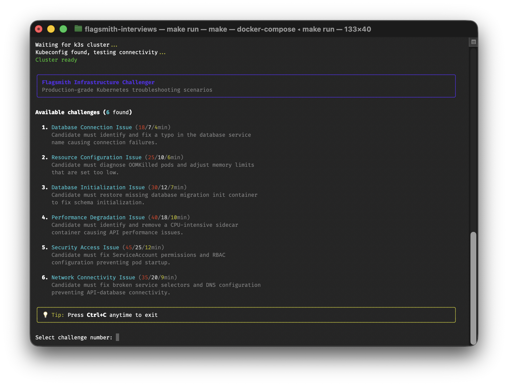
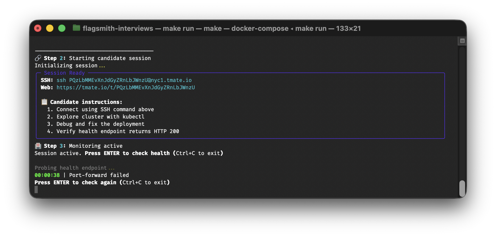

# Flagsmith Interview Challenge System

A technical interview system that creates broken Flagsmith deployments for infrastructure debugging challenges.

## Overview

This system provides a self-contained Docker environment where candidates can debug real Flagsmith infrastructure issues. The interviewer selects a challenge, and the system creates a broken Kubernetes deployment that the candidate must fix using standard debugging tools.

## Requirements

- Docker (with Docker Compose)

## Quick Start

1. **Clone and start the system:**
   ```bash
   git clone <repository-url>
   cd flagsmith-interviews
   make run
   ```

2. **Select a challenge** from the interactive menu with time estimates

3. **Share the tmate session URL** with the candidate

4. **Monitor progress** via the CLI health checks and timer

5. **End the session** with Ctrl+C when complete

## CLI Demo

The interviewer interface guides you through the complete workflow with three main screens:

### 1. Challenge Selection


Select from available debugging scenarios with time estimates for different skill levels.

### 2. Session Management


Monitor the candidate session with real-time health checks and connection details.

### 3. Challenge Completion


Track progress and verify successful resolution of the infrastructure issue.

**Key Features:**
- **Time Estimates**: Bronze/Silver/Gold time targets for performance benchmarking
- **Real-time Monitoring**: Health checks and session status during candidate sessions
- **Automatic Management**: Handles deployment, monitoring, and cleanup

## Architecture

The system consists of three main components:

- **CLI Container**: Python application for challenge management and monitoring
- **K3s Cluster**: Lightweight Kubernetes cluster running Flagsmith
- **Candidate Environment**: tmate session with kubectl, helm, and debugging tools

## Available Challenges

The system automatically discovers challenges from YAML files in the `challenges/` directory.

For more information on which challenges are available, please refer to that directory, or run the program.

## Contributing Challenges

**See [CONTRIBUTING.md](./CONTRIBUTING.md) for complete guidelines on creating challenges.**

### Quick Overview

Each challenge requires two files:

1. **Challenge Definition** (`{name}.yaml`)
   - Defines the broken Kubernetes setup using Helm values and kubectl patches
   - Required fields: `name`, `description`, `estimates`, `helm_values`, `kubectl_patches`

2. **Reviewer Manual** (`{name}.md`)
   - Step-by-step solution guide for interviewers
   - Educational learning points and prevention strategies
   - Must exist alongside every challenge YAML file

### Requirements

- Both YAML and markdown files must be present
- All YAML fields are required (no optional fields)
- Time estimates should be realistic integers, or `"∞"` when unsuitable for a skill level
- Manuals are automatically referenced when challenges are selected
- The system will fail immediately if required files or fields are missing

See [CONTRIBUTING.md](./CONTRIBUTING.md) for detailed guidelines on naming conventions, validation, testing, and educational standards.

## Candidate Experience

### Available Tools
- `kubectl` - Kubernetes CLI
- `helm` - Helm package manager
- `curl` - HTTP client for testing
- `jq` - JSON processor
- `nano`/`vim` - Text editors
- Standard Unix tools (`grep`, `awk`, `sed`, etc.)

### Typical Workflow
1. **Connect** to the provided tmate session
2. **Explore** the cluster: `kubectl get pods -n flagsmith`
3. **Investigate** issues: `kubectl logs <pod>`, `kubectl describe pod <pod>`
4. **Identify** the root cause through systematic debugging
5. **Fix** the configuration: `kubectl edit deployment flagsmith-api`
6. **Verify** health: `kubectl port-forward svc/flagsmith-api 8000:8000`

### Success Criteria
The Flagsmith API should respond with HTTP 200 on the `/health/liveness/` endpoint.

## Commands

```bash
make run            # Start the interview system (includes automatic cleanup)
```

## Development

### Project Structure
```
├── cli/                    # Python CLI application with health monitoring
├── candidate-env/          # Candidate debugging environment with tmate
├── challenges/             # Challenge YAML files with solutions
├── docker-compose.yml      # Service orchestration
├── Makefile               # Convenience commands
└── pyproject.toml         # Python dependencies
```

### Architecture Notes
- K3s runs in Docker with kubeconfig shared via volumes
- CLI container has Docker socket access for candidate container management
- Candidate environment is ephemeral per challenge
- Health checks use kubectl port-forward for reliability
- Challenges use Helm values + optional kubectl patches

## Performance

- K3s startup: ~30 seconds
- Flagsmith deployment: ~2-3 minutes
- Challenge setup: ~1 minute
- **Total time to candidate access: ~4 minutes**

## Security

- Candidates have full kubectl access within the isolated cluster
- No access to host system or Docker daemon
- Network traffic isolated within Docker network
- Sessions are ephemeral and automatically cleaned up
- Each challenge runs in a fresh environment
